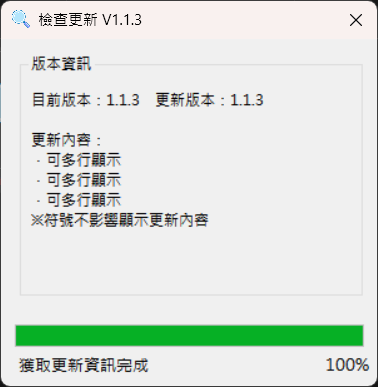

## 這是一項 2020 年開發的專案，能夠透過 Updater 讓更新檔自動下載並解壓縮覆蓋，目前已停止更新。<br>

### Updater



### 結構

client<br>
|-- data<br>
&emsp;&emsp;|-- cheakURI.txt<br>
|-- update.exe<br>
|-- version.txt

<br>

*cheakURI.txt* <br>
是用來檢查更新的網址，網址指向伺服器的 serverversion.txt。<br>
```
https://raw.githubusercontent.com/wonk2563/Update/refs/heads/main/serverversion.example.txt
```
<br>

*update.exe* <br>
當啟動時會開啟 cheakURI.txt 中的網址，將 version.txt 與 serverversion.txt 的版本比對，若較舊則開始會更新。<br>

*version.txt* <br>
用來標註目前版本。<br>
```
1.1.3
```
<br><br>

server<br>
|-- yourData<br>
|-- serverversion.txt

<br>

*serverversion.txt* <br>
用來標註伺服器版本、更新檔解壓縮出來的資料夾名稱、更新內容、更新檔下載網址。<br>
```
1.1.3
updater
．可多行顯示
．可多行顯示
．可多行顯示
※符號不影響顯示更新內容
https://github.com/wonk2563/Update/releases/download/Release/exampleUpdateData.zip
```